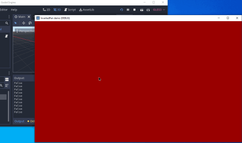

InvertedPenGodotTest
====================

Test for experimental inverted pen detection in Godot Engine 4



## Usage

Build godot engine:
```
git clone -b eraser-detect-4 https://github.com/hansemro/godot.git
cd godot
scons platform=<windows|osx|linux>
```

Launch godot engine from godot/bin/ and import demo project (`demo/project.godot`).

Run `InvertedPen demo`.

Place and move cursor around the window. Red and green background colors
correspond to non-inverted and inverted status, respectively.

The background also brightens when the stylus/mouse is pressed.
